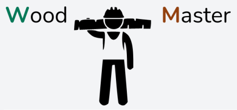

# WoodMaster
### Ein einfaches Holzverwaltungstool 
__*vom Stamm zum Brett*__

Startprojekt für ein Holz-ERP

1. Vorraussetzungen
 * Dieses Projekt wird mit Laravel und Livewire im Docker-Container via Laravel Sail entwickelt
 * Die Anwendung nutzt Laravel Octane mit Swoole

2. Installation
 ```bash 
 git clone https://github.com/marodatavision/woodmaster
 cd woodmaster
 ./vendor/bin/sail up
 composer install
 npm install && npm run dev
 ```
 